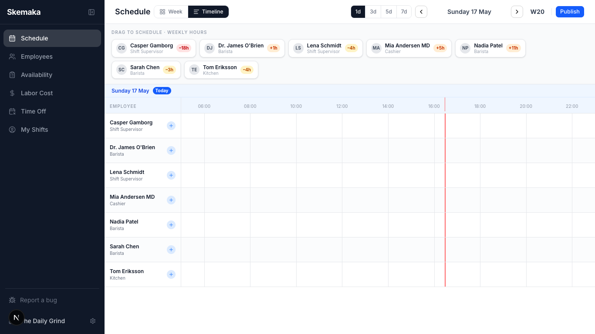
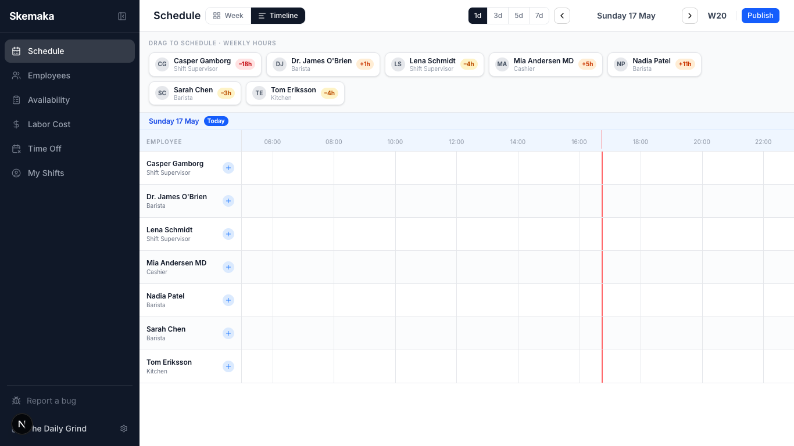
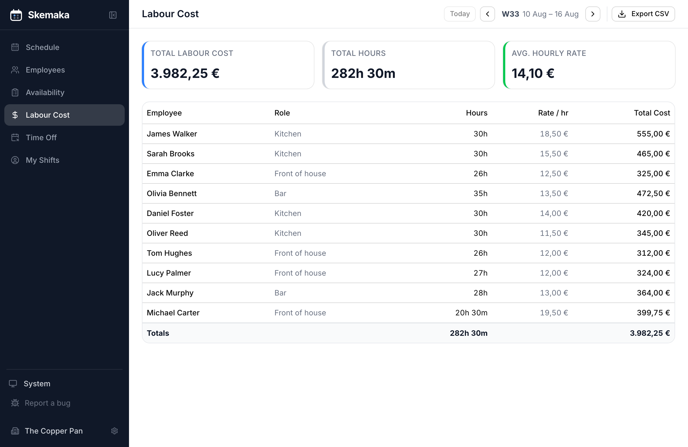
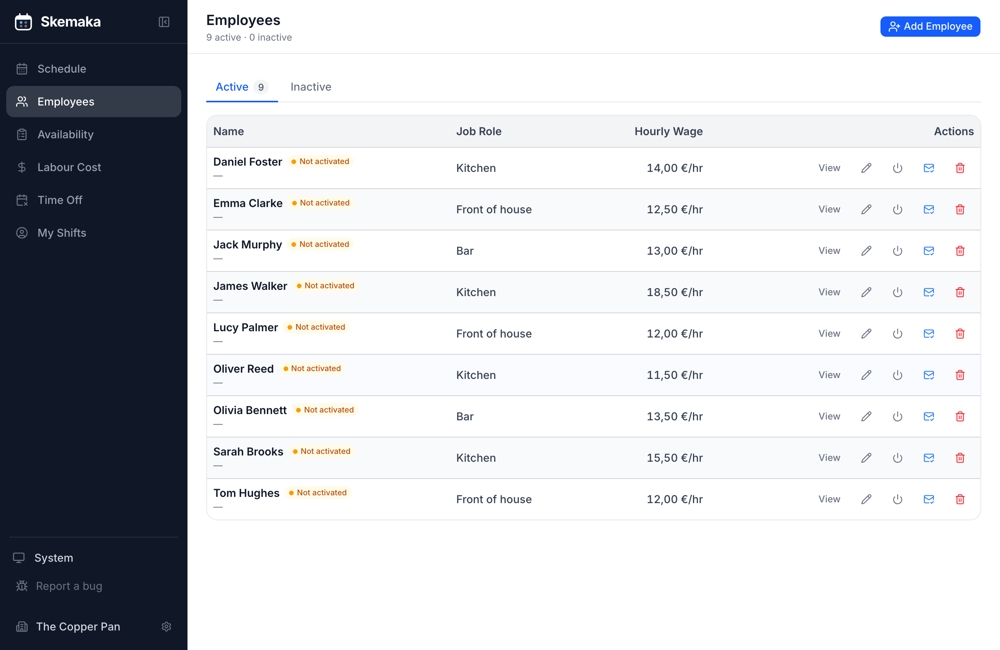
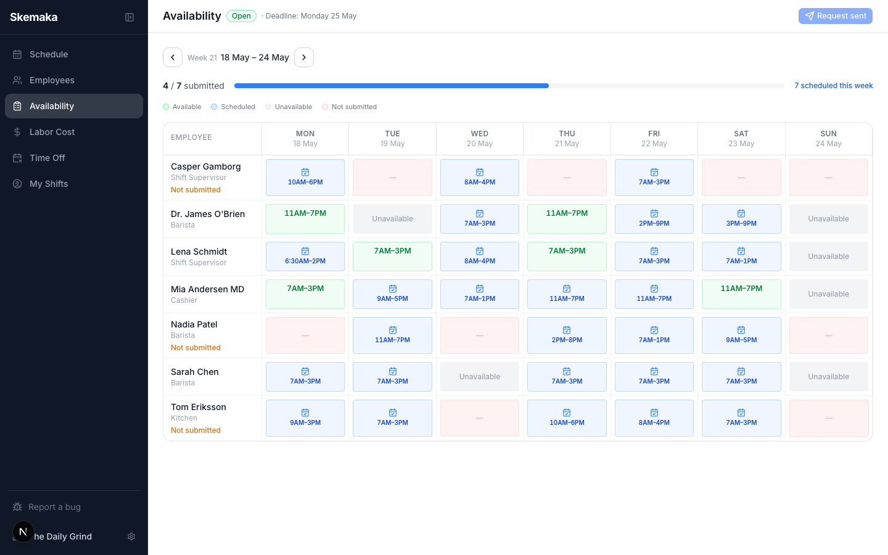

# Skemaka

**Staff scheduling SaaS for restaurants and cafés.** Managers build weekly rotas by drag-and-drop, track labour cost against contracted hours, and handle time-off, availability and shift swaps. Employees see their shifts, clock in and out, and request cover — from the web portal or a native mobile app.

Built and shipped solo: product, design, full-stack engineering, infrastructure, billing and compliance.

**[▶ Try the live demo](https://skemaka.com/demo)** — no signup, no email. Spins up a throwaway restaurant with a week of realistic data and drops you in as the manager.

<sub>Production: [skemaka.com](https://skemaka.com) · ~55k lines of TypeScript · 745 automated tests · 75 API routes · 25 data models · 2 locales</sub>



---

## Why this repo is worth a look

Most portfolio SaaS projects stop at CRUD. The interesting parts of this one are the places where correctness is genuinely hard — money, concurrency, time zones and multi-tenancy — and where I chose to solve the problem properly rather than route around it.

### Concurrency is handled at the database, not in JavaScript

Two managers on the same rota, or an employee double-tapping "clock in" on bad restaurant Wi-Fi, are ordinary events here — not edge cases. Check-then-act in application code loses those races.

- `SELECT … FOR UPDATE` row locks serialise the critical sections ([`lib/services/locks.ts`](apps/web/lib/services/locks.ts)), covering seat purchases, clock-in, cover requests and shift offers.
- A **partial unique index** enforces "one open time entry per employee" in the database itself, so the invariant holds even from a path that never read `locks.ts` ([migration](apps/web/prisma/migrations/20260813140000_add_partial_unique_indexes/migration.sql)).
- Dedicated race tests hammer the real thing concurrently: [`clockAndShiftRace`](apps/web/lib/__integration__/clockAndShiftRace.test.ts), [`coverRace`](apps/web/lib/__integration__/coverRace.test.ts), [`offerRace`](apps/web/lib/__integration__/offerRace.test.ts).

That migration also documents the constraint I deliberately *didn't* add — one shift per employee per day — because split shifts (lunch 11:00–14:00, dinner 18:00–23:00 for the same chef) are normal in hospitality, and a unique index cannot express a range predicate.

### CI hunts the bug classes that a green suite hides

The unit suite mocks Prisma, so it can assert the *shape* of a query but says nothing about what SQL does with it. Both of these shipped green and were caught by adding a layer, not by adding assertions:

- `colorTag: { not: "sick" }` compiles to `colorTag <> 'sick'`, which is `NULL` for uncoloured rows — silently dropping them from roll-out **and from payroll export**. Now there is an [integration suite against real Postgres](apps/web/lib/__integration__/), run through Neon's `wsproxy` so it exercises the same serverless driver production uses.
- Prisma stores `DateTime` as `timestamp WITHOUT time zone`; raw SQL comparing one against `NOW()` is wrong by the session offset. On a UTC runner that offset is zero and the bug is invisible. CI now runs the suite under **UTC and UTC+14**, and the unit suite under **Kiritimati (+14) and Midway (−11)** — the extremes of the inhabited range.

Neither pass alone is enough: UTC proves production works but hides the bug class; UTC+14 exposes the bug class but tests a timezone production never uses. [`.github/workflows/ci.yml`](.github/workflows/ci.yml)

### Billing that fails safe

Per-seat Stripe subscriptions with graduated tiers, webhook-driven and idempotent ([`ProcessedStripeEvent`](apps/web/prisma/schema.prisma) dedupes redeliveries).

The guard never denies on a possibly-stale JWT: if the token's billing snapshot *would* block, it re-reads the authoritative row from the database before returning `402`, so a customer who just paid is never locked out by their own cached token ([`lib/apiGuard.ts`](apps/web/lib/apiGuard.ts)). Seat changes take a row lock and are validated against real usage before Stripe is told anything.

### Multi-tenancy enforced in depth

`orgId` and `role` ride in the JWT, so the common path is zero database queries — with a membership-table fallback for the window between org creation and the next sign-in. Tenant isolation has [its own test suite](apps/web/lib/__tests__/tenantIsolation.test.ts). Super-admin "act as org" is a separate, audited capability writing to a `SuperAdminAudit` log rather than a boolean bypass.

### Product decisions, not just features

- **Publishing is per shift, not per week.** A rota is private until rolled out; editing a published shift returns it to draft so changes are re-published deliberately rather than going out silently. Drafts are filtered server-side, so an employee's API response never contains one.
- **Three distinct staffing flows** that are easy to conflate and shouldn't be: *availability* (employee states when they can work), *cover* (employee asks to be relieved of a shift they have), *shift offer* (manager pushes an unassigned shift to a group).
- **SMS compliance is built in** — inbound STOP/START/HELP via a Twilio webhook, with an opt-out list maintained on top of carrier-level handling.

---

## Screens

| | |
|---|---|
|  <br> **Timeline** — drag a name onto a row to create a shift; 15-minute snap, live "hours met / under / over contract" badges. |  <br> **Labour cost** — scheduled hours × wage, overnight shifts counted correctly, CSV payroll export. |
|  <br> **Team** — wages, contracted hours, employment type, job roles, invite links. |  <br> **Availability** — token-based forms collected into a weekly grid that feeds auto-generate. |

---

## Architecture

```
apps/
  web/        Next.js 16 App Router — manager UI, employee portal, platform admin, API
  mobile/     Expo / React Native — employee app (shifts, clock, availability, cover)
packages/
  types/      @skemaka/types  — canonical shared interfaces
  api/        @skemaka/api    — ApiClient + TanStack Query hooks (consumed by mobile)
  ui/         @skemaka/ui     — shared design tokens
  i18n/       @skemaka/i18n   — message catalogues (en, da)
```

Requests flow **route handler → service → Prisma**. Route handlers do auth, rate limiting and Zod validation, then delegate; all domain logic lives in [`lib/services/`](apps/web/lib/services/) where it is testable without HTTP. Prisma objects never reach a response directly — [`lib/serialize.ts`](apps/web/lib/serialize.ts) converts `Decimal → number` and `Date → ISO string` at the boundary.

Web and mobile share types and API hooks through the workspace, so a change to a response shape is a compile error in both apps rather than a runtime surprise in one.

**Security posture:** full CSP (with `unsafe-eval` stripped in production), HSTS with `preload`, frame-deny, Upstash rate limiting on 49 of 55 mutating endpoints, Zod validation on every request body, signature verification on both Stripe and Twilio webhooks, and parameterised SQL only — the handful of raw queries are tagged template literals.

| Layer | Choice |
|---|---|
| Monorepo | Turborepo + npm workspaces |
| Web | Next.js 16 (App Router), React 19, Tailwind 4, shadcn/ui, dnd-kit |
| Mobile | Expo 54, expo-router, NativeWind, TanStack Query, Zustand |
| Database | Neon serverless Postgres + Prisma 7 (Neon adapter) |
| Auth | NextAuth 5 — JWT strategy, Google OAuth (web), bearer tokens + Apple Sign-In (mobile) |
| Billing / comms | Stripe · Resend · Twilio · Upstash Redis · web push |
| Tests | Vitest (unit + integration) · Playwright (e2e) |
| Hosting | Vercel (incl. cron) · EAS (mobile) |

---

## Testing

745 automated tests across three layers, each chosen for what the layer below cannot see.

| Layer | Count | What it covers | Gate |
|---|---:|---|---|
| **Unit** (Vitest, Prisma mocked) | 699 | Services, guards, billing arithmetic, serialisation, date handling, i18n key parity | Every push — plus two timezone extremes |
| **Integration** (Vitest, real Postgres) | 29 | SQL three-valued logic, constraints, transaction isolation, row locking, concurrent races | Every push — under UTC and UTC+14 |
| **E2E** (Playwright) | 17 | Access control, trial paywall, invite claim, onboarding, roll-out, timesheet export | Nightly, and on any PR touching API, services, auth, billing or schema |

```bash
npm test                  # 699 unit tests — fast, hermetic, no database
npm run test:integration  # 29 tests against a real Postgres (see SETUP.md)
npm run test:e2e          # 17 Playwright specs
npm run typecheck         # tsc --noEmit across all 6 packages
```

A parity test fails CI if any locale's keys or ICU placeholders drift from English — the `en` and `da` catalogues are held at 1,315 keys each.

---

## Running it locally

Needs Node 20.19+, npm, and a Postgres database (Neon or local). Everything runs from the repo root.

```bash
git clone https://github.com/Gamborg0101/skemaka.git
cd skemaka
npm install

cp apps/web/.env.example apps/web/.env.local   # fill in DATABASE_URL + AUTH_SECRET at minimum
npm run db:push
npm run db:seed

npm run dev:web     # http://localhost:3000
npm run dev:mobile  # Expo
```

The seed creates one manager account plus a week of realistic roster data. Set `SEED_ADMIN_EMAIL` in `.env.local` to your own address so the seeded admin matches the account you sign in with.

[**SETUP.md**](./SETUP.md) walks through the third-party providers (Google OAuth, Stripe, Resend, Twilio, Upstash) and the full environment variable reference.

---

## Repo map

| Path | |
|---|---|
| [`apps/web/lib/services/`](apps/web/lib/services/) | Domain logic — the part worth reading first |
| [`apps/web/lib/apiGuard.ts`](apps/web/lib/apiGuard.ts) | Auth, billing enforcement, body validation |
| [`apps/web/components/manager/ShiftTimeline.tsx`](apps/web/components/manager/ShiftTimeline.tsx) | Drag-and-drop rota builder |
| [`apps/web/prisma/schema.prisma`](apps/web/prisma/schema.prisma) | 25 models, 10 enums, 21 migrations |
| [`.github/workflows/ci.yml`](.github/workflows/ci.yml) | The timezone matrix and path-filtered E2E |
| [`docs/`](docs/) | Restore runbook, migration runbook, internal launch notes |

---

## Status

Deployed to production on Vercel + Neon, with CI and the nightly E2E suite green. The mobile app is built and running against the same API; app-store submission is queued behind the remaining operational setup (tax and SMS sender registration). The full go-live checklist is in [`docs/internal/before-launch.md`](docs/internal/before-launch.md).

Known gaps I'd close next, in order: component-level UI tests (the service layer is well covered, rendering is not), error aggregation (Sentry rather than the current homegrown digest), and an automated accessibility pass in CI.

---

## Licence

Source-available for review. © Casper Gamborg — all rights reserved; not licensed for reuse or redistribution.
